# Решение заданий итоговой контрольной работы

1. Используя команду cat в терминале операционной системы Linux, создать
два файла Домашние животные (заполнив файл собаками, кошками,
хомяками) и Вьючные животными заполнив файл Лошадьми, верблюдами и
ослы), а затем объединить их. Просмотреть содержимое созданного файла.
Переименовать файл, дав ему новое имя (Друзья человека).

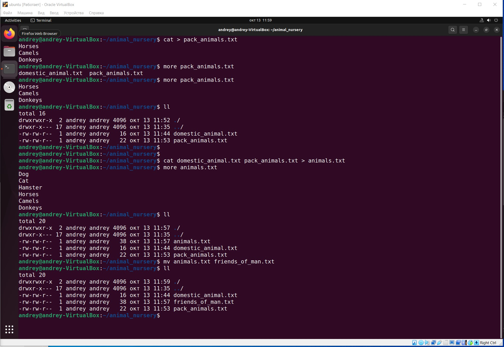

2. Создать директорию, переместить файл туда.
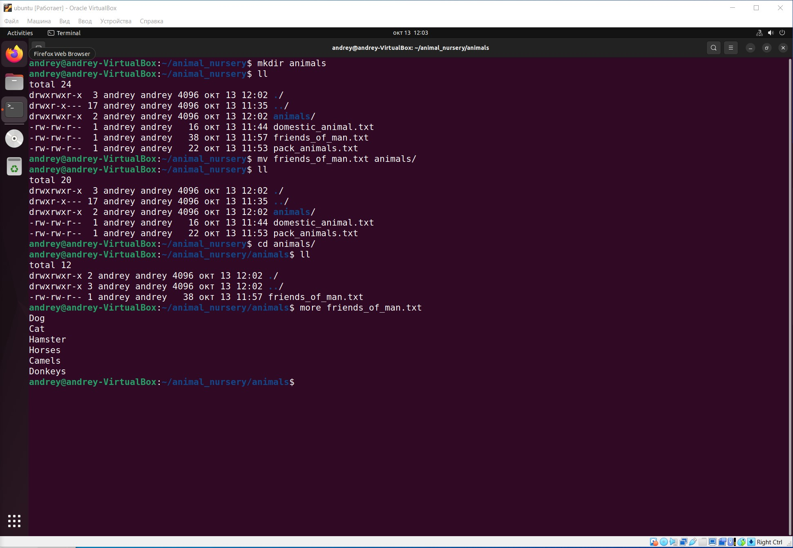

3. Подключить дополнительный репозиторий MySQL. Установить любой пакет из этого репозитория.

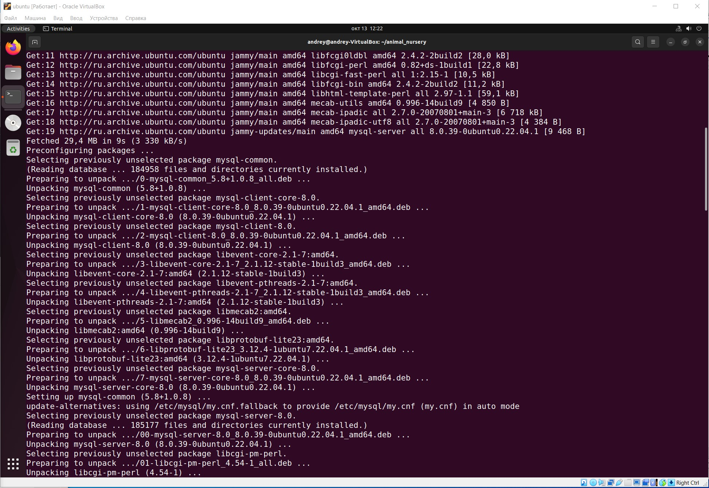
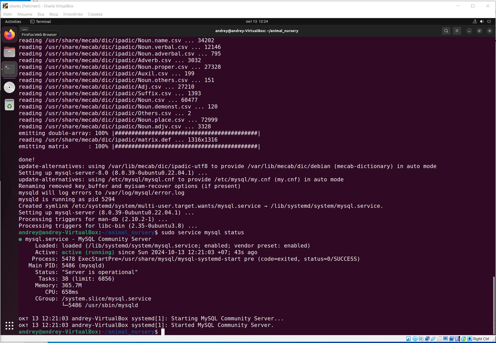

4. Установить и удалить deb-пакет с помощью dpkg.
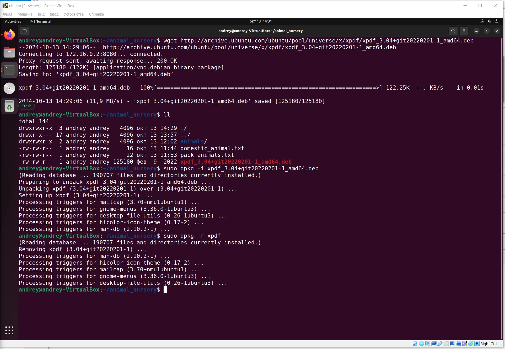

5. Выложить историю команд в терминале ubuntu
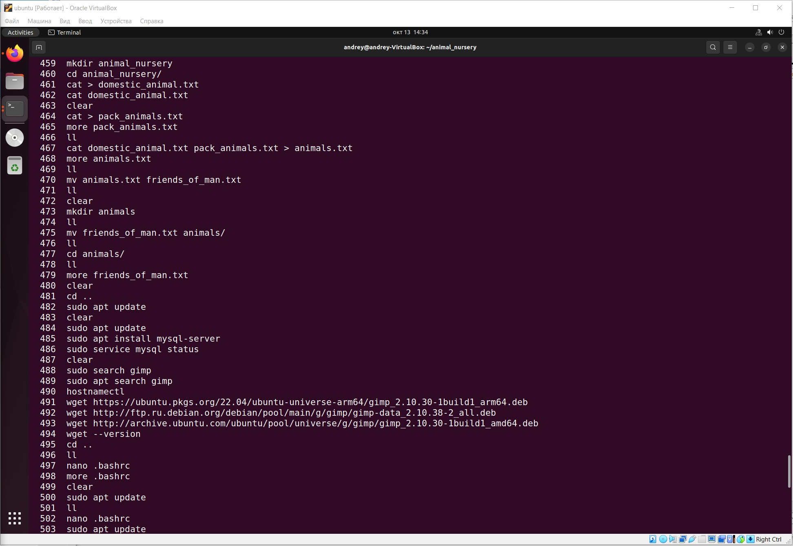
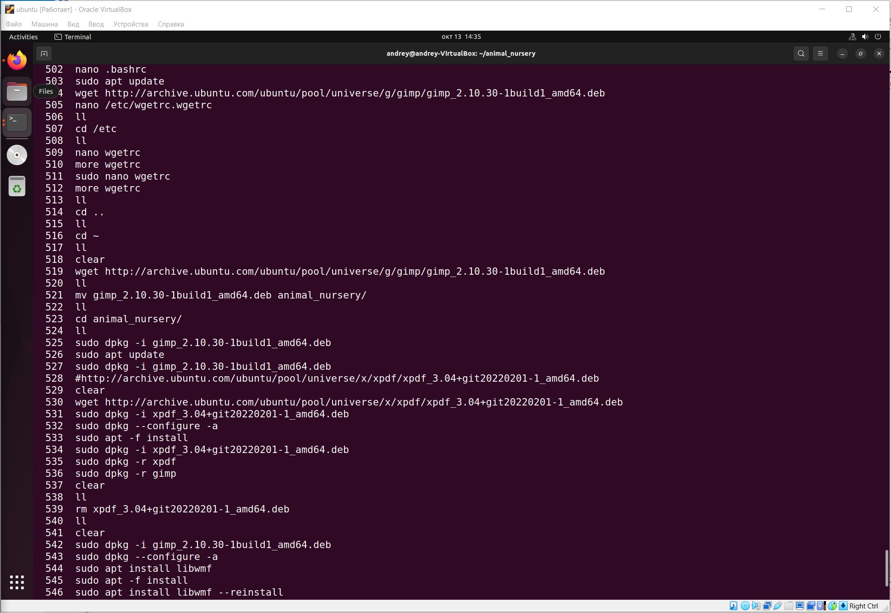
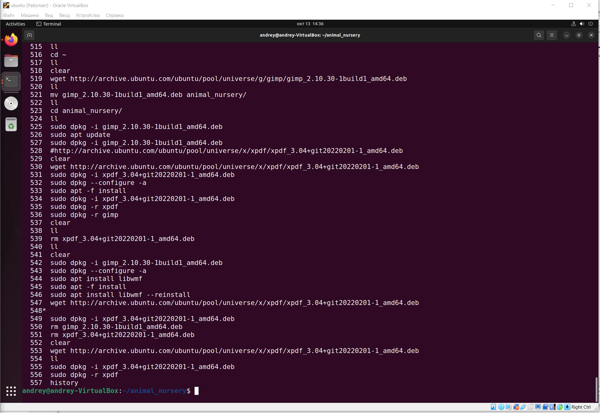

Количество команд немного больше чем ожидалось при выполнении задании. Это связано с тем, что на компьютере где выполнялось задание стоит прокси. Всвязи с этим пришлось решать проблему выхода через прокси для программы wget!

6. Нарисовать диаграмму, в которой есть класс родительский класс, домашние животные и вьючные животные, в составы которых в случае домашних животных войдут классы: собаки, кошки, хомяки, а в класс вьючные животные войдут: Лошади, верблюды и ослы).
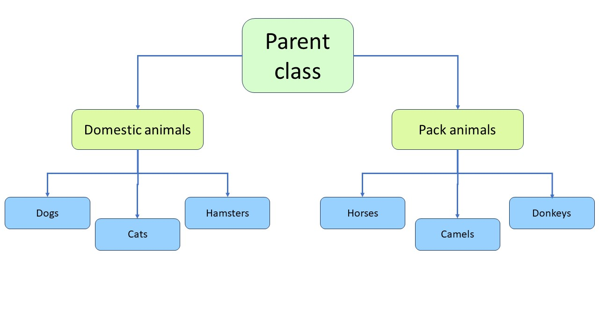

7. В подключенном MySQL репозитории создать базу данных “Друзья человека”
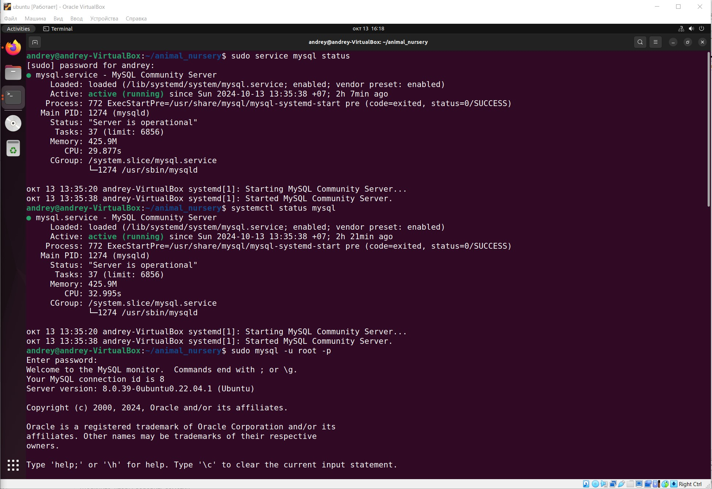
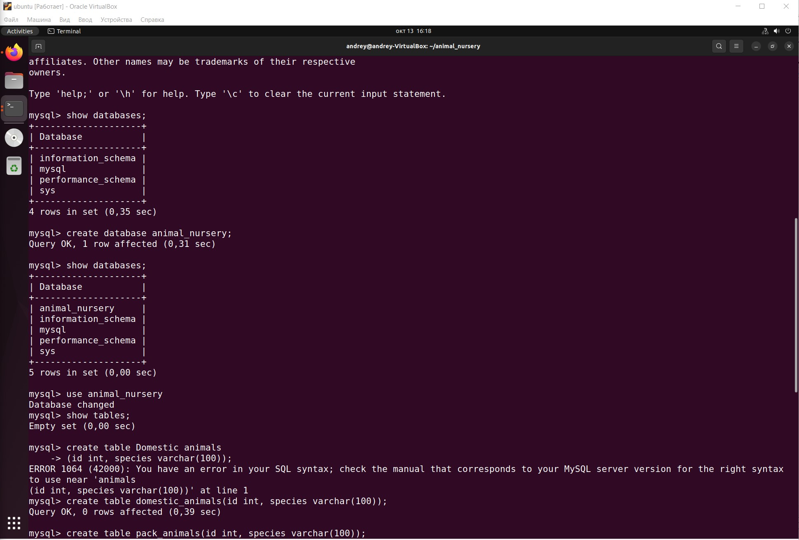
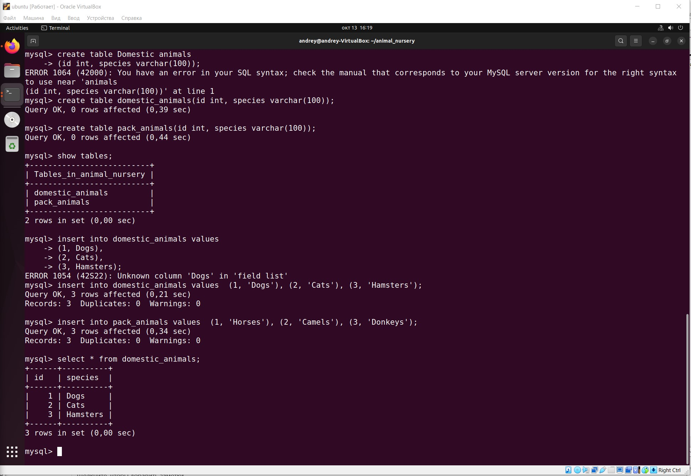

## SQL

8. Создать таблицы с иерархией из диаграммы в БД
```sql
create table domestic_animals
(
	id int auto_increment,
	species varchar(100) not null,
	primary key (id)
);

create table pack_animals
(
	id int auto_increment,
	species varchar(100) not null,
	primary key (id)
);

create table dogs
(
	id int auto_increment,
	name varchar(100),
	commands varchar(100),
	birth_date date,
	primary key (id)
);

create table cats
(
	id int auto_increment,
	name varchar(100),
	commands varchar(100),
	birth_date date,
	primary key (id)
);

create table hamsters
(
	id int auto_increment,
	name varchar(100),
	commands varchar(100),
	birth_date date,
	primary key (id)
);

create table horses
(
	id int auto_increment,
	name varchar(100),
	commands varchar(100),
	birth_date date,
	primary key (id)
);

create table camels
(
	id int auto_increment,
	name varchar(100),
	commands varchar(100),
	birth_date date,
	primary key (id)
);

create table donkeys
(
	id int auto_increment,
	name varchar(100),
	commands varchar(100),
	birth_date date,
	primary key (id)
);
```

9. Заполнить низкоуровневые таблицы именами(животных), командами
которые они выполняют и датами рождения

```sql
insert into dogs (name, commands, birth_date) values 
	('Шарик', 'Сидеть', '2023-10-19'),
	('Дружок', 'Лежать', '2023-05-03'),
	('Мухтар', 'Голос', '2024-01-01');

insert into cats (name, commands, birth_date) values 
	('Мурзик', 'ко мне', '2023-04-30'),
	('Пушок', 'прыжок', '2023-07-23'),
	('Гав', 'Голос', '2024-02-01');

insert into hamsters (name, commands, birth_date) values 
	('Рыжик', 'стоять', '2023-03-15'),
	('Снежок', 'перевернуться', '2023-07-25'),
	('Бусинка', 'фырк', '2024-03-01');

insert into horses (name, commands, birth_date) values 
	('Орлик', 'стой', '2020-03-15'),
	('Верный', 'тпрууу', '2021-07-25'),
	('Зевс', 'Но', '2019-04-01');

insert into camels (name, commands, birth_date) values 
	('Тушкан', 'Гит', '2018-03-17'),
	('Патрон', 'Каш', '2017-08-25'),
	('Дона', 'Хап-Хап', '2019-05-01');

insert into donkeys (name, commands, birth_date) values 
	('Масик', 'Пошел', '2018-07-17'),
	('Оскар', 'Стой', '2019-08-05'),
	('Дора', 'Быстрей', '2020-06-01');
```

10. Удалив из таблицы верблюдов, т.к. верблюдов решили перевезти в другой
питомник на зимовку. Объединить таблицы лошади, и ослы в одну таблицу.

```sql
drop table camels;

-- Добавляем таблицы без id
create table equidae as
select name, commands, birth_date from horses h
union
select name, commands, birth_date from donkeys d; 

-- добавляем поле id
alter table equidae
add id int (11) not null first;

alter table equidae
add index (id);

-- Делаем поле id с автозаполнением
alter table equidae
change id id int(11) not null auto_increment;

select * from equidae;
```

11. Создать новую таблицу “молодые животные” в которую попадут все
животные старше 1 года, но младше 3 лет и в отдельном столбце с точностью
до месяца подсчитать возраст животных в новой таблице

```sql
create table young_animals
select *, concat
	(
		floor((timestampdiff(month, birth_date, curdate()) / 12)), ' Years ', 
		mod(timestampdiff(month, birth_date, curdate()), 12), ' Months'
	) as age
from (
select 'dog' as type_animal, name, commands, birth_date from dogs d 
union
select 'cat' as type_animal, name, commands, birth_date from cats c
union
select 'hamster' as type_animal, name, commands, birth_date from hamsters h 
union
select 'horse' as type_animal, name, commands, birth_date from horses h2
union
select 'donkey' as type_animal, name, commands, birth_date from donkeys d2 
) as animals
where birth_date >= date_sub(curdate(), interval 3 year)
and birth_date <= date_sub(curdate(), interval 1 year)
;

-- добавляем поле id
alter table young_animals
add id int (11) not null first;

alter table young_animals
add index (id);

-- Делаем поле id с автозаполнением
alter table young_animals
change id id int(11) not null auto_increment;

select * from young_animals;
```

12. Объединить все таблицы в одну, при этом сохраняя поля, указывающие на
прошлую принадлежность к старым таблицам.
```sql
create table all_animals
select * from
	(
	select 'dog' as type_animal, name, commands, birth_date from dogs d 
	union
	select 'cat' as type_animal, name, commands, birth_date from cats c
	union
	select 'hamster' as type_animal, name, commands, birth_date from hamsters h 
	union
	select 'horse' as type_animal, name, commands, birth_date from horses h2
	union
	select 'donkey' as type_animal, name, commands, birth_date from donkeys d2 
	) as animals
;

-- добавляем поле id
alter table all_animals
add id int (11) not null first;

alter table all_animals
add index (id);

-- Делаем поле id с автозаполнением
alter table all_animals
change id id int(11) not null auto_increment;

select * from all_animals;
```
